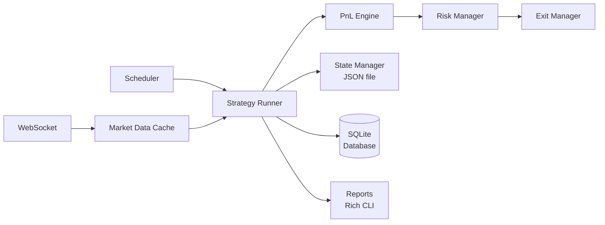
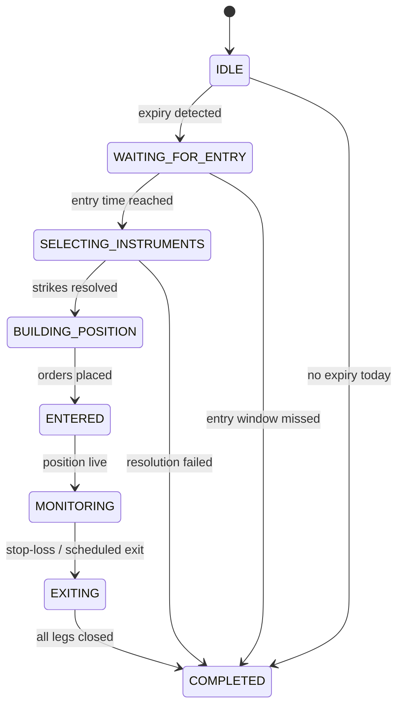

# Ratio Spread Bot

[](https://www.python.org/)
[](config/config.yaml)
[](tests/)
[](pyproject.toml)
[]()

Fully automated expiry-day **Ratio Spread** algorithmic trading system for **NIFTY** and **SENSEX** weekly options. Connects to **Upstox** for real-time market data and executes in **paper trading mode** (no real orders sent to broker).

> **Version:** v0.2.0 | **Requires:** Python 3.12+

---

## Features

- **Fully automated** — entry, monitoring, and exit on expiry day with no manual intervention
- **Paper trading engine** — simulated execution at last traded price (no capital at risk)
- **Real-time market data** — Upstox WebSocket feed with protobuf-decoded ticks
- **Config-driven strategy** — all parameters in YAML, validated via Pydantic
- **SQLite trade persistence** — WAL-mode database with repository pattern for all trade history
- **Crash recovery** — atomic JSON state file enables mid-session restart without data loss
- **Rich CLI reports** — per-session PnL, trade details, session statistics, and aggregated metrics
- **Structured logging** — per-day, per-category log files (7 channels)
- **State machine execution** — enforced lifecycle prevents invalid state transitions
- **Unit tested** — 48 tests across 9 test suites with strict typing (mypy) and linting (ruff)

---

## Strategy Overview

A **Ratio Spread** is an options strategy that combines long and short positions to capture time decay (theta) while limiting directional risk. This implementation trades a **1:N ratio** — buying one ATM option and selling multiple OTM options on each side.

### Position Construction

```
Entry (09:27 IST)
  ├── Buy  1 ATM  Call  (long  premium)
  ├── Buy  1 ATM  Put   (long  premium)
  ├── Sell N OTM  Call  (short premium)
  └── Sell N OTM  Put   (short premium)

  Goal: Capture expiry-day theta decay on the short legs
        while maintaining a defined risk profile.
```

- **Instruments:** NIFTY weekly expiries (primary), SENSEX weekly expiries (fallback)
- **Entry time:** 09:27 IST (configurable)
- **Exit time:** 15:27 IST (configurable), or immediately on 1% stop-loss
- **Sell multiplier:** Configurable (`sell_multiplier` determines N — default 3)

### Current Assumptions

- Weekly expiries only (no monthly or quarterly)
- NIFTY is preferred; SENSEX is used if NIFTY has no expiry today
- One trade per day (no re-entry after exit)
- Paper trading only (no real order placement)
- Sell multiplier is configurable per run
- No re-entry after a position is exited

---

## Prerequisites

- Python 3.12+
- Upstox API credentials (for WebSocket market data)
- Windows Task Scheduler (for daily 8 AM auto-start)

> **Further reading:** [ARCHITECTURE.md](ARCHITECTURE.md) — system design & state machine · [CHANGELOG.md](CHANGELOG.md) — version history · [DECISIONS.md](DECISIONS.md) — ADRs · [TODO.md](TODO.md) — roadmap

---

## Installation

```bash
# 1. Clone and enter the project
cd ratio-spread

# 2. Install the package with dev dependencies
pip install -e ".[dev]"

# 3. Copy env template and fill in your Upstox credentials
copy .env.template .env
# Then edit .env with your API key, secret, and access token
```

---

## Configuration

### config.yaml (`config/config.yaml`)

All strategy parameters live in this file — no hardcoded values:

```yaml
config_version: "1.0"

application:
  timezone: Asia/Kolkata
  paper_trading: true

broker:
  name: upstox

strategy:
  name: ratio_spread

trading:
  margin: 650000               # Total margin for position sizing
  entry_time: "09:27:00"       # Entry time (IST)
  exit_time: "15:27:00"        # Scheduled exit time (IST)
  monitor_interval: 1          # Safety timer interval (seconds)
  stop_loss_percent: 1.0       # Max loss % of margin
  strike_interval: 50          # ATM rounding interval
  buy_lots: 1                  # Lots to buy per leg
  sell_multiplier: 3           # Sell multiplier (1:3 ratio)
  lot_sizes:
    NIFTY: 65
    SENSEX: 20

symbols:
  nifty:
    enabled: true
  sensex:
    enabled: true

database:
  sqlite_path: data/trading.db

state:
  state_file: state/position_state.json

logging:
  log_directory: logs/
  level: INFO

reports:
  directory: reports/
```

### Parameter Reference

| Parameter | Description | Default |
|-----------|-------------|---------|
| `margin` | Total available margin for position sizing (₹) | `650000` |
| `entry_time` | Scheduled entry time (IST) | `"09:27:00"` |
| `exit_time` | Scheduled exit time (IST) | `"15:27:00"` |
| `stop_loss_percent` | Maximum acceptable loss as % of margin | `1.0` |
| `strike_interval` | ATM strike rounding interval (points) | `50` |
| `buy_lots` | Number of lots to buy per ATM leg | `1` |
| `sell_multiplier` | Number of lots to sell per OTM leg (ratio) | `3` |
| `monitor_interval` | Safety timer wake-up interval (seconds) | `1` |
| `lot_sizes` | Contract lot size per instrument | `NIFTY: 65`, `SENSEX: 20` |
| `paper_trading` | Enable paper trading mode | `true` |
| `logging.level` | Logging verbosity | `INFO` |
| `database.sqlite_path` | Path to SQLite database file | `data/trading.db` |
| `state.state_file` | Path to crash-recovery state file | `state/position_state.json` |

### .env File

```env
UPSTOX_API_KEY=your_api_key_here
UPSTOX_API_SECRET=your_api_secret_here
UPSTOX_ACCESS_TOKEN=your_access_token_here
```

---

## Running the Engine

### Manual Start

```bash
python app/main.py
```

The system will:
1. Load config and connect to Upstox
2. Check if today is NIFTY expiry (falls back to SENSEX)
3. Wait until 09:27 IST
4. Construct and execute the ratio spread
5. Monitor MTM on every market tick (plus a 1-second safety timer)
6. Exit at 15:27, on 1% stop-loss (evaluated per-tick), or on crash recovery
7. Generate reports and shut down

### Scheduled Start (Windows Task Scheduler)

1. Open **Task Scheduler** → **Create Basic Task**
2. Trigger: **Daily** at **8:00 AM**
3. Action: **Start a program**
   - Program: `C:\path\to\python.exe`
   - Arguments: `app/main.py`
   - Start in: `C:\path\to\ratio-spread-bot`

The built-in safeguard ensures: if started after 09:32 (5 min grace), it skips trading.

---

## Architecture

### System Overview

Event-driven paper trading system for expiry-day NIFTY/SENSEX ratio spreads.

### Module Relationships

```
app/main.py (entry point)
  ├── app/startup.py     — dependency injection
  ├── app/scheduler.py   — time triggers
  ├── app/shutdown.py    — graceful shutdown
  │
  ├── strategy/
  │     ├── base_strategy.py    # Abstract base
  │     └── ratio_spread.py
  │           └── engine/strategy_runner.py
  │                 ├── engine/pnl_engine.py
  │                 ├── engine/risk_manager.py
  │                 ├── engine/exit_manager.py
  │                 ├── engine/market_data_cache.py
  │                 └── engine/strategy_state_machine.py
  │
  ├── broker/
  │     ├── broker_interface.py
  │     ├── upstox_broker.py
  │     ├── paper_broker.py
  │     ├── websocket_client.py
  │     ├── instrument_resolver.py
  │     └── MarketDataFeed_pb2.py   # Protobuf stubs
  │
  ├── database/
  │     ├── sqlite_manager.py
  │     └── repository.py
  │
  ├── state/state_manager.py
  ├── reports/ (4 report generators)
  └── utils/
        ├── config.py
        ├── logging.py
        └── models.py
```

### Data Flow



### Execution State Machine



| State | Description |
|-------|-------------|
| `IDLE` | System initialized, waiting for expiry detection |
| `WAITING_FOR_ENTRY` | Expiry confirmed, waiting for entry time |
| `SELECTING_INSTRUMENTS` | Resolving ATM strikes and sell strikes from option chain |
| `BUILDING_POSITION` | Placing orders and persisting position data |
| `ENTERED` | Position placed, transitioning to monitoring |
| `MONITORING` | Active position — per-tick MTM and stop-loss evaluation |
| `EXITING` | Exiting all legs (scheduled, stop-loss, or crash recovery) |
| `COMPLETED` | Session finalized, reports generated |

> **Note:** Position-holding states (`BUILDING_POSITION`, `ENTERED`, `MONITORING`) must pass through `EXITING` before reaching `COMPLETED`. This ensures open legs are never left unclosed.

### Strategy Flow

```
08:00 Start (via Task Scheduler)
  → Initialize config, DB, WebSocket
  → Check NIFTY expiry → if not, check SENSEX
  → If no expiry today → shutdown

09:27 Enter ratio spread
  → Select ATM strikes, construct 1:N ratio spread
  → Buy 1 ATM Call + 1 ATM Put
  → Sell N OTM Calls + N OTM Puts (sell_multiplier from config)
  → Transition to ENTERED → MONITORING state

09:27 – 15:27 Monitor (per-tick + safety timer)
  → On every market tick: recalculate MTM, check stop-loss
  → Every 1 second: safety timer re-evaluates MTM & stop-loss
  → If loss >= 1% of margin → exit immediately (stop-loss)

15:27 Exit all positions (if not already out)
  → Transition to EXITING, place crash-recoverable exit orders
  → Generate reports, save final state
  → Shutdown
```

### Crash Recovery

If the application crashes mid-session, restarting auto-detects the saved state in `state/position_state.json` and resumes monitoring without re-entering.

---

## Example Trading Session

The following is a **simulated example** of console output during a trading session. Actual results will vary.

```
2026-07-01 08:00:15 — System initialized
2026-07-01 08:00:16 — Today is NIFTY expiry — trading
2026-07-01 09:27:00 — Entry window reached
2026-07-01 09:27:01 — Position entered: ATM=19600 SELL CE=19750 SELL PE=19450 MTM=0.00 Margin=650000.00
2026-07-01 09:41:18 — PnL: Profit MTM=+2150.00 Profit=0.33%
2026-07-01 10:52:44 — PnL: Profit MTM=+5980.00 Profit=0.92%
2026-07-01 13:15:02 — PnL: Profit MTM=+3850.00 Profit=0.59%
2026-07-01 15:27:00 — Scheduled exit at 15:27:00
2026-07-01 15:27:01 — Exit completed: reason=SCHEDULED_EXIT final_mtm=6420.00
2026-07-01 15:27:02 — Session finalized: PnL=6420.00 reason=SCHEDULED_EXIT
```

---

## Example Reports

The following are **example values** from a completed session. Actual results depend on market conditions.

```
Session Statistics
══════════════════
Net Profit             ₹6,420.00
Gross Profit           ₹14,800.00
Gross Loss             ₹(8,380.00)
Maximum MTM            ₹6,420.00
Maximum Drawdown       ₹(450.00)
Win Rate               100.00%
Return on Capital       0.99%
Sharpe Ratio            1.42
```

> Reports are auto-generated after each session and saved as text files in the configured reports directory.

---

## Screenshots

### Rich CLI Report

*Screenshot placeholder — reports render in the terminal using the Rich library.*

### Strategy Logs

*Screenshot placeholder — per-day log files capture every strategy event.*

### Database Schema

*Screenshot placeholder — SQLite database with 6 tables for full trade history.*

---

## Viewing Reports

### Saved Report Files

```
reports/2026-07-01/
    pnl_report.txt       # PnL summary
    trade_report.txt     # Per-leg trade details
    session_report.txt   # Session statistics
    statistics.txt       # Win rate, max MTM, etc.
```

View them:

```bash
# PowerShell
Get-Content reports/2026-07-01/pnl_report.txt
Get-Content reports/2026-07-01/trade_report.txt
Get-Content reports/2026-07-01/statistics.txt
```

### Standalone PnL Report

A Rich-formatted report script that reads from the database and displays per-day summary, position breakdown, and overall statistics (win rate, RoC, max drawdown, Sharpe ratio):

```bash
python scripts/pnl_report.py
```

---

## Viewing Logs

```
logs/2026-07-01/
    strategy.log       # Strategy events (entry, exit, MTM)
    orders.log         # All order fills
    market_data.log    # Price updates
    websocket.log      # Connection status
    database.log       # DB operations
    reports.log        # Report generation
    error.log          # Errors and warnings
```

```bash
# Watch strategy logs in real-time
Get-Content logs/2026-07-01/strategy.log -Wait

# View today's errors
Get-Content logs/2026-07-01/error.log
```

---

## Database Queries

The SQLite database is at `data/trading.db`. Query it with `sqlite3` or any SQLite browser:

```bash
# Connect to the database
sqlite3 data/trading.db

# View all trading days
SELECT trading_date, instrument, total_profit, exit_reason FROM strategy_runs;

# PnL per day
SELECT trading_date, instrument, total_profit, margin_used,
       ROUND(total_profit / margin_used * 100, 2) AS return_pct
FROM strategy_runs
ORDER BY trading_date DESC;

# Per-day summary (includes gross profit/loss)
SELECT trading_date, instrument, gross_profit, gross_loss,
       net_profit, max_mtm, min_mtm, exit_reason
FROM daily_summary
ORDER BY trading_date DESC;

# All orders for a specific run
SELECT * FROM orders WHERE strategy_run_id = 1;

# MTM history (every second) for a run
SELECT timestamp, mtm, profit_percentage
FROM pnl_history
WHERE strategy_run_id = 1
ORDER BY timestamp;

# View configuration used for a run
SELECT config_json FROM configuration_snapshot WHERE strategy_run_id = 1;
```

---

## Testing

The test suite covers 9 component areas with **48 tests**:

| Test Suite | Scope |
|------------|-------|
| `test_config.py` | Configuration loading and validation |
| `test_pnl_engine.py` | Position-level and portfolio MTM calculation |
| `test_risk_manager.py` | Stop-loss detection and fail-safe behavior |
| `test_exit_flow.py` | Exit execution and stop-loss money path |
| `test_repository.py` | Database persistence layer |
| `test_state_machine.py` | State transition validation |
| `test_state_manager.py` | JSON crash recovery save/load |
| `test_instrument_resolver.py` | Expiry detection and strike selection |
| `test_full_session.py` | End-to-end entry → monitor → exit flow |

### Running Tests

```bash
# Run all tests
pytest

# Run tests with verbose output
pytest -v

# Run a specific test file
pytest tests/test_pnl_engine.py -v
```

---

## Development Commands

```bash
# Lint check
ruff check .

# Auto-fix lint issues
ruff check --fix .

# Type check (strict mode)
mypy .

# Format code
black .

# Full quality check (run before committing)
ruff check . && mypy . && pytest -q
```

---

## Project Structure

```
ratio-spread/
├── app/                    # Application entry point
│   ├── main.py             # Start here
│   ├── startup.py          # Dependency injection
│   ├── scheduler.py        # Time triggers
│   └── shutdown.py         # Graceful shutdown
├── broker/                 # Upstox integration
│   ├── broker_interface.py # Abstract interface
│   ├── paper_broker.py     # Paper execution
│   ├── upstox_broker.py    # Upstox API
│   ├── websocket_client.py # Live market data
│   ├── instrument_resolver.py
│   └── MarketDataFeed_pb2.py # Protobuf stubs
├── strategy/               # Trading logic
│   ├── base_strategy.py    # Abstract base
│   └── ratio_spread.py     # Ratio spread implementation
├── engine/                 # Core engine
│   ├── strategy_runner.py  # Lifecycle coordinator
│   ├── pnl_engine.py       # MTM calculation
│   ├── risk_manager.py     # Stop-loss (per-tick)
│   ├── exit_manager.py     # Exit execution (crash-recoverable)
│   ├── market_data_cache.py
│   └── strategy_state_machine.py
├── database/               # Persistence
│   ├── sqlite_manager.py
│   ├── repository.py
│   └── schema.sql
├── state/                  # Crash recovery
│   └── state_manager.py
├── reports/                # Rich CLI reports
│   ├── pnl_report.py
│   ├── session_report.py
│   ├── statistics.py
│   └── trade_report.py
├── scripts/                # Standalone utilities
│   └── pnl_report.py       # Rich-formatted PnL report
├── utils/
│   ├── config.py           # Configuration loader
│   ├── logging.py          # Structured logging
│   └── models.py           # Pydantic domain models
├── tests/                  # Test suites
│   ├── conftest.py
│   ├── test_config.py
│   ├── test_exit_flow.py
│   ├── test_full_session.py
│   ├── test_instrument_resolver.py
│   ├── test_pnl_engine.py
│   ├── test_repository.py
│   ├── test_risk_manager.py
│   ├── test_state_machine.py
│   └── test_state_manager.py
├── config/
│   └── config.yaml
├── data/                   # SQLite database
├── logs/                   # Per-day log files
├── pyproject.toml          # Project metadata & deps
├── ARCHITECTURE.md         # System design & state machine
├── CHANGELOG.md            # Version history
├── DECISIONS.md            # Architecture Decision Records (ADRs)
├── TODO.md                 # Development roadmap
├── .env.template
└── .gitignore
```

---

## Current Limitations

- **Paper trading only** — no live order placement; all executions are simulated
- **Upstox broker only** — single broker implementation via the broker interface
- **Weekly expiry support** — monthly and quarterly expiries are not handled
- **Windows Task Scheduler** — scheduling examples target Windows only
- **Single strategy** — only the ratio spread strategy is implemented

---

## Roadmap

- [x] Paper trading engine
- [x] SQLite persistence with repository pattern
- [x] JSON-based crash recovery
- [x] Rich CLI reports (PnL, trade, session, statistics)
- [ ] Live trading adapter
- [ ] Telegram / email alerts
- [ ] Web dashboard
- [ ] Multi-broker support
- [ ] Docker deployment
- [ ] CI/CD pipeline
- [ ] Portfolio analytics and historical performance views

---

## Contributing

1. **Fork** the repository
2. **Create a branch** (`git checkout -b feature/my-feature`)
3. Run formatting and linting before committing:
   ```bash
   black .
   ruff check --fix .
   mypy .
   pytest -q
   ```
4. **Commit** your changes (`git commit -m "Add feature"`)
5. **Push** to the branch (`git push origin feature/my-feature`)
6. **Open a Pull Request**

---

## Risk Disclaimer

**This software is provided for educational and research purposes only.**

Options trading involves substantial financial risk, including the potential loss of more than the initial margin deposited. Past performance and simulated results do not guarantee future returns.

The authors and contributors of this project:
- Make no warranties, expressed or implied, regarding the software's fitness for any purpose
- Are not responsible for any financial losses incurred through the use of this software
- Recommend consulting a qualified financial advisor before engaging in any trading activity

Users are solely responsible for their own trading decisions and compliance with applicable regulations.

---

## License

License to be added.